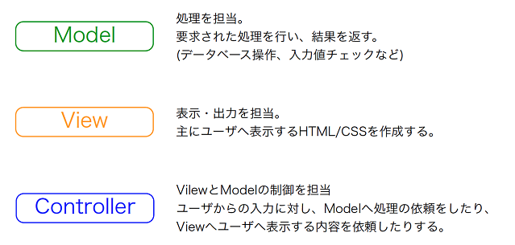
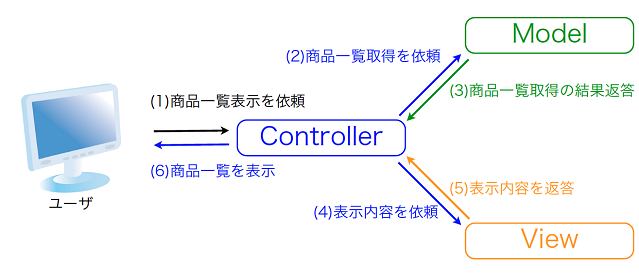

https://blog.codecamp.jp/php_mvc01

# MVCモデルとは
## ソフトウェアの設計モデルの1つです。 
- 処理の中核を担う「Model」、表示・出力を司る「View」、入力を受け取りその内容に応じてViewとModelを制御する「Controller」の組み合わせでシステムを実装します。

- Model
  - 処理を担当。要求された処理を行い、結果を返す。
  - (データベース操作、入力値チェックなど)
  
- View
  - 表示・出力を担当。
  - 主にユーザーへ表示するHTML/CSSを作成する。
  
- Controller
  - ViewとModelの制御を担当。
  - ユーザーからの入力に対し、Modelへの処理の依頼をしたり、viewへユーザーへ表示する内容を依頼したりする。
  
